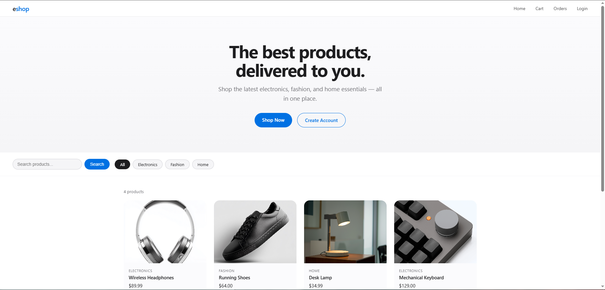

# eshop

A full-stack e-commerce web application built with Java Spring Boot, PostgreSQL, and Thymeleaf.

Homepage


## Tech Stack

- **Backend** — Java 21, Spring Boot 3.5, Spring Security
- **Database** — PostgreSQL with Spring Data JPA / Hibernate
- **Frontend** — Thymeleaf, HTML5, CSS3
- **Build Tool** — Maven
- **Version Control** — Git / GitHub

## Features

- Browse products by category or search by name
- Product detail pages with customer reviews
- User registration and login with encrypted passwords
- Shopping cart with add/remove functionality
- Checkout and order placement
- Order history page
- Fully responsive design for mobile and desktop
- Modern Apple-inspired UI

## Pages

| Page | URL |
|---|---|
| Home | `/` |
| Product Detail | `/product/{id}` |
| Cart | `/cart` |
| Checkout | `/checkout` |
| Orders | `/orders` |
| Login | `/login` |
| Register | `/register` |

## Getting Started

### Prerequisites

- Java JDK 17+
- Maven
- PostgreSQL

### Setup

1. Clone the repository
```bash
   git clone https://github.com/YOUR_USERNAME/eshop.git
   cd eshop
```

2. Create a PostgreSQL database
```sql
   CREATE DATABASE eshop;
```

3. Create `src/main/resources/application-secrets.properties`
```properties
   DB_USERNAME=your_postgres_username
   DB_PASSWORD=your_postgres_password
```

4. Run the application
```bash
   ./mvnw spring-boot:run
```

5. Open your browser at `http://localhost:8081`

## Project Structure